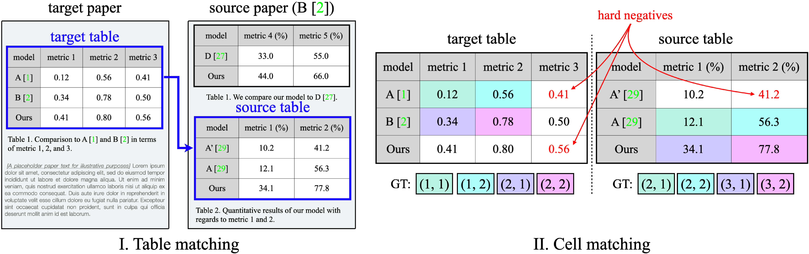

## arXiVeri: Automatic table verification with GPT

Official PyTorch implementation of **arXiVeri: Automatic table verification with GPT**. Details can be found in the paper.
[[`paper`](https://arxiv.org/pdf/2304.14376.pdf)][[`project page`](https://www.robots.ox.ac.uk/~vgg/research/arxiveri/)]



## Contents
* [Important note](#important-note)
* [Preparation](#preparation)
* [Inference](#inference)
* [Citation](#citation)

## Important note
Running a script present in this repository might cost you for running a commercial LLM (e.g., GPT-4).
Please be aware that we are not responsible for the cost you will incur.

## Preparation
### 0. Fork or download this repository

### 1. Set your API keys in your .bashrc file or your corresponding configuration file for your shell.
```shell
export OPENAI_API_KEY={YOUR_OPENAI_API_KEY}
export COHERE_API_KEY={COHERE_API_KEY}  # production-key
```
Note that you can omit the COHERE_API_KEY if you do not want to use Cohere embeddings for the table matching.
To get the API keys, please visit the following links:
* [OpenAI](https://openai.com/)
* [Cohere](https://cohere.com/)

## Inference
### Table matching
For running a script for table matching, use `run-table-matcher.sh` in the `scripts` directory.
```shell
cd scripts
bash run-table-matcher.sh
```

By default, the code will use the weighting mechanism (details in the paper).
If you want to disable it, simply get rid of the `-w` argument in the script file. 

Importantly, note that it will firstly try to use the provided embeddings in the `table_to_embedding` directory and if there is no pre-extracted embedding, it will start the extraction process **_which will cost you for running an embedding model_**.

### Cell matching
For running a script for cell matching, use `run-cell-matcher-t0-{csv, html, md}.sh` in the `scripts` directory.
```shell
cd scripts
bash run-cell-matcher-t0-html.sh
```
**_Again, we remind you that running the script will cost you for running GPT-4.
Approximately, it will cost about 50-100 USD._**
The responses from GPT-4 will be saved in a `results` directory.

## Citation
```
@article{shin2023arxiveri,
  title = {arXiVeri: Automatic table verification with GPT},
  author = {Shin, Gyungin and Xie, Weidi and Albanie, Samuel},
  journal = {arXiv:xxxx.xxxxx},
  year = {2023}
}
```

If you have any questions about our code/implementation, please contact us at gyungin [at] robots [dot] ox [dot] ac [dot] uk.
